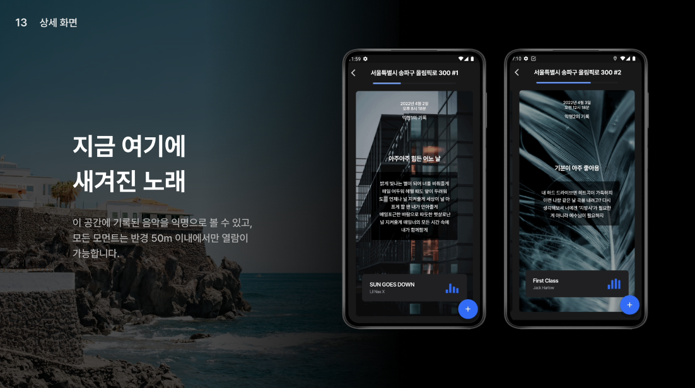
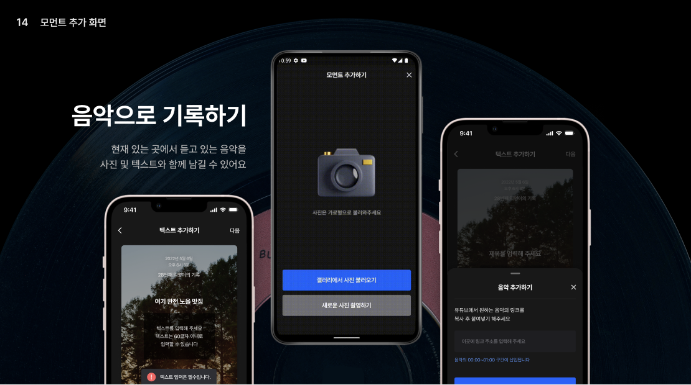
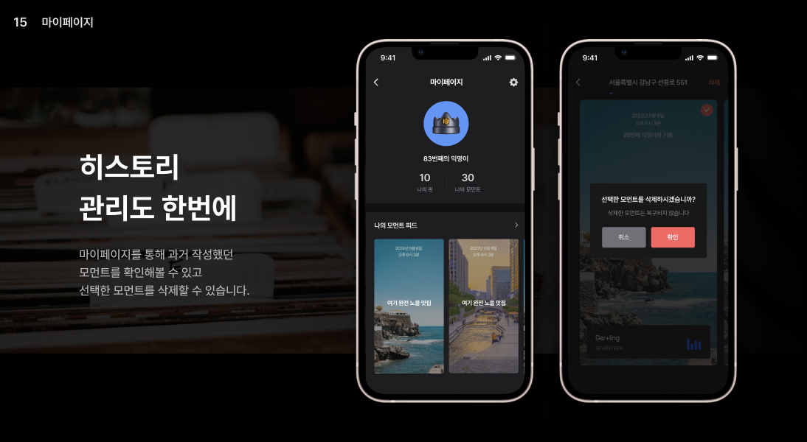
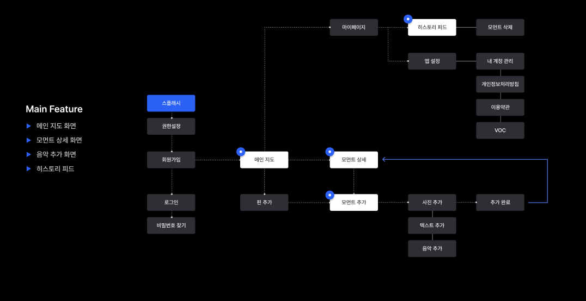

## mmnt-server

공간에 대한 기억을 음악과 함께 기록하는 서비스, **MMNT** 입니다.  
오늘 있었던 장소에 핀을 꽂은 뒤, 현재 듣고 있는 음악과 사진을 모먼트로 기록하거나,  다른 사람이 등록한 핀에 나의 모먼트를 작성할 수 있어요.

 

### Teck Stack
---
- Nest.js
- TypeScript
- PostgreSQL
- AWS Infra

  
 

### Main Feature
---
1. 메인 지도 화면
2. 모먼트 상세 화면
3. 음악 추가 화면
4. 히스토리 피드

 

### API Lists
---
- [x] 인증 번호 이메일 발송 API
- [x] 인증 번호 확인 API
- [x] 회원가입 API
- [x] 로그인 API
- [x] 유저 정보 변경 및 비밀 번호 찾기 API
- [x] 유저 프로필 조회 API
- [x] 유저 위치 수정 및 근처 핀 모먼트 조회 API 
- [x] 핀 및 모먼트 생성 API
- [x] 나의 모먼트 히스토리 조회 API
- [x] 핀 별 모먼트 리스트 조회 API
- [x] 모먼트 삭제 API
- [x] 회원 탈퇴 API

 

### MMNT SERVICE
---

 

### License
---
Copyright © 2022 Kimdoha.
This project is MIT licensed.